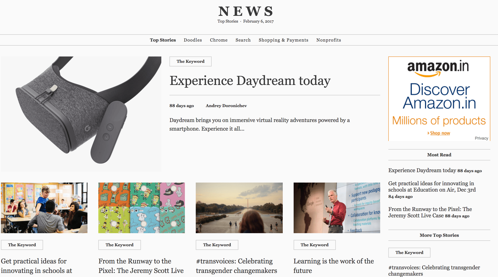
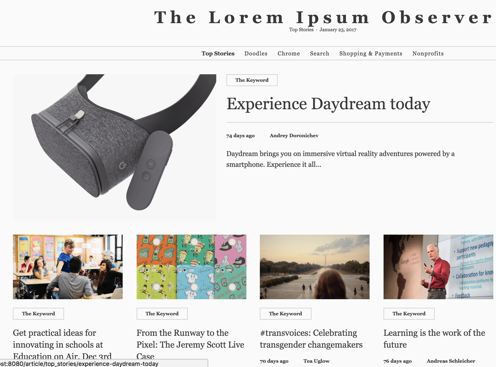
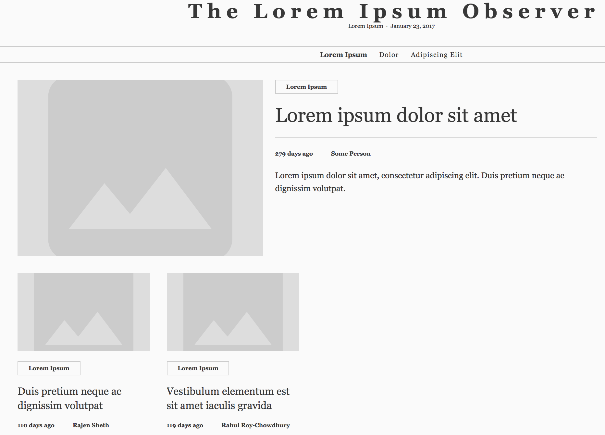
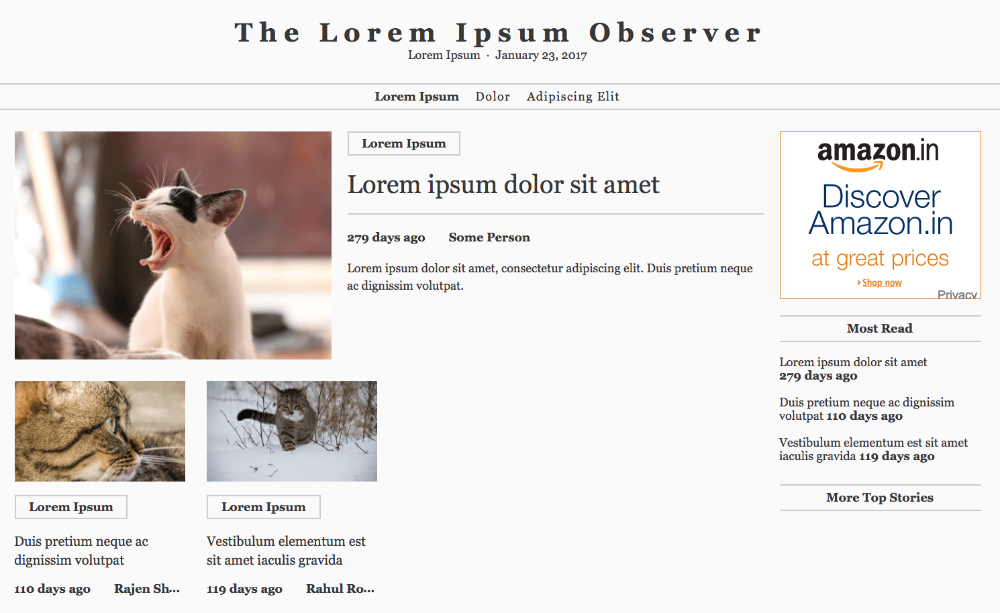
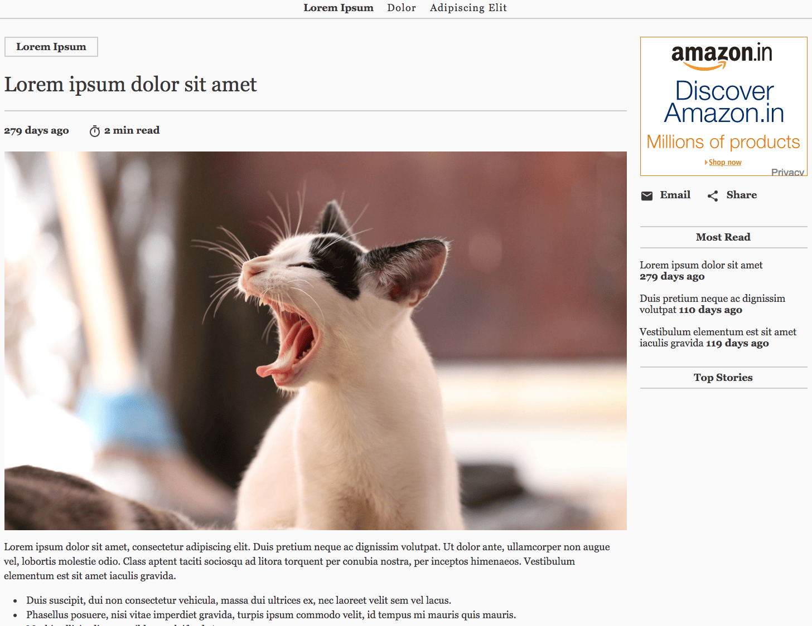

<!-- toc -->

This tutorial will quickly guide you through plugging your own content into the News app and publishing your site.

To follow it, you’ll need a set of articles in html files, along with all of the images you need to display or link to.

Notes:

* This guide is for populating your News app with content. To change the look and feel of your app, see the documentation on Theming and styling the News app.

* For information on how the News app was implemented, see the Case Study.

## Step 1: Change the name of your site

Choose a name for your site, and update it in index.html. Change the document title:

`index.html`
```html
<title>The Lorem Ipsum Observer</title>
```

Also, update the value of the app-title property and the contents of <news-app>:

`index.html`
```html
<body>
  ...
  <news-app unresolved app-title="The Lorem Ipsum Ovserver">The Lorem Ipsum Observer</news-app>
  ...
</body>
```

Before {.caption}



After {.caption}


## Step 2: Set up categories for your content

### 2.1 In news-data.html, replace the default categories list with your own.

`news-data.html`: Before {.caption}

```html
<dom-module id="news-data">
  <script>
  (function() {
    var categoryList = [
      {name: 'top_stories', title: 'Top Stories'},
      {name: 'doodles', title: 'Doodles'},
      {name: 'chrome', title: 'Chrome'},
      {name: 'search', title: 'Search'},
      {name: 'shopping_payments', title: 'Shopping & Payments'},
      {name: 'nonprofits', title: 'Nonprofits'}
    ];
```

`news-data.html`: After {.caption}
```html
<dom-module id="news-data">
  <script>
  (function() {
    var categoryList = [
      {name: 'lorem', title: 'Lorem Ipsum'},
      {name: 'dolor', title: 'Dolor'},
      {name: 'adipiscing_elit', title: 'Adipiscing Elit'},
    ];
```

### 2.2 Update the default route

In news-app.html, update the default route to one of your categories:

`news-app.html`: Before {.caption}
```
_routePageChanged: function(page) {
  if (!page) {
    // set default route if route path is empty
    this.set('route.path', 'list/top_stories');
    return;
  }
```

`news-app.html`: After {.caption}
```
_routePageChanged: function(page) {
  if (!page) {
    // set default route if route path is empty
    this.set('route.path', 'list/lorem');
    return;
  }
```

### 2.3 Create `.json` files for each category

For each category, create a `.json` file containing a list of the articles and article metadata in that category. Follow the [specification for <category>.json files](https://docs.google.com/document/d/1DmL34vDDjpkaZ45dWMzwdA9sTfB9JjFdZWaKDD8Muo0/edit#). Alternately, you could implement a web service that returns the list of articles for a given category in this format.

*Note: **Category files are dynamically loaded. A specific **<category>.json** file is not loaded until that category is selected. Only the default route is loaded right away.*

Place the <category>.json files in the /data folder; or modify news-data.html to point to the location of your <category>.json files.

`news-data.html`: Before {.caption}
```
this._fetch('/data/' + category.name + '.json',
  function(response) {
    this.set('category.items', this._parseCategoryItems(response));
  }.bind(this),
  attempts || 1 /* attempts */);
```

`news-data.html`: After {.caption}
```
this._fetch('http://your/path/here/' + category.name + '.json',
  function(response) {
    this.set('category.items', this._parseCategoryItems(response));
  }.bind(this),
  attempts || 1 /* attempts */);
```

Before: {.caption}



After: {.caption}



## Step 3: Add your html files and images

News articles are regular HTML files, and should be valid. These files are served directly for indexing by search bots - see the Case Study for more information.

Article content must be in an element with a `.content` class:
```
<body>
  <div class="content">
    <div>
    ...
    </div>
  </div>
</body>
```
This is the content that will be displayed by the News app.

When you have a set of suitable files, add your HTML content and images to the relevant folders.

* Put your html files in `data/articles`.
* Put your images in `data/images`.

After: {.caption}





## Step 4: Remove default/placeholder content

Once you’ve got your own content up and running, you can delete the placeholder content in the `/data` folder.

* From `/data`, remove any .json files for any categories that don’t exist.

* From `/data/articles`, remove any .html files that you don’t need.

* From `/data/images`, remove any images that you don’t need.

## Step 5: Publish your app

### 5.1 Build the app

To build your app, open a terminal, go to the `/news` folder and type

```
polymer build
```

### 5.2 Test the build

To test the build, you can serve your app on the development server. The polymer build command generates both a bundled and unbundled version of your app.

* In a bundled build, all fragments are bundled into the same file to reduce the number of file requests. This is optimal for sending to clients or serving from servers that are not HTTP/2 compatible.

* In an unbundled build, fragments are left in separate files. Optimal for HTTP/2-compatible servers and clients.

You can choose whether to serve the bundled or unbundled version.

To serve the unbundled version of your app:

```
dev_appserver.py build/unbundled
```

To serve the bundled version of your app:

```
dev_appserver.py build/bundled
```

### 5.3 Deploy to Google App Engine

To deploy your app to Google App Engine:

```
gcloud app deploy build/bundled/app.yaml --project [YOUR_PROJECT_ID]
```
